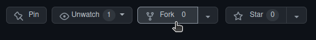

# OplossingenOndersteunendeVragenComputerarchitectuur
[](https://github.com/JoeyDeSmet/OplossingenOndersteunendeVragenComputerarchitectuur/actions/workflows/build_production.yml)

## How to contribute

1. Fork this repository



2. Clone the repository to your local machine

```bash
git clone git@github.com:YOUR_GITHUB_NAME/OplossingenOndersteunendeVragenComputerarchitectuur.git
```

3. Track the original repository as a remote fork

```bash
git remote add --track main upstream git@github.com:JoeyDeSmet/OplossingenOndersteunendeVragenComputerarchitectuur.git
git fetch upstream
```

4. Create a new branch for your changes

```bash
git checkout -b chapter6 upstream/main
```

5. Make your changes

6. Add, commit, and push your changes

```bash
git add .
git commit -m "Added some solutions for chapter 6"
```

```bash
git push -u origin chapter6
```

7. Submit a pull request
    - Go to yout github account to the forked repo
    - A popup will be visable to Compare & pull request
    - Click the popup
    - Add a description and create pull request 

## Adding a new chapter

1. Create a folder in the /docs/src/chapters/ directory with the name of the chapter e.g. 'Chapter6'
2. Add README.md file in folder and write text there
3. Add a link to chapter in the main README.md file

```text
# Chapters

- [Chapter 1: Introducing Computer Architecture](/chapters/chapter1/)
- [Chapter 3: Processor Elements](/chapters/chapter3/)
// Add other chapters
```

4. Edit the /docs/src/.vuepress/config.js file to include the chapter

```js
sidebar: {
      '/chapters/': [
        {
          title: 'Chapters',
          collapsable: false,
          children: [
            ['/chapters/chapter1/', 'Chapter1'],
            ['/chapters/chapter3/', 'Chapter3'],
            // Add chapter here
          ]
        },
      ],
    }
```
