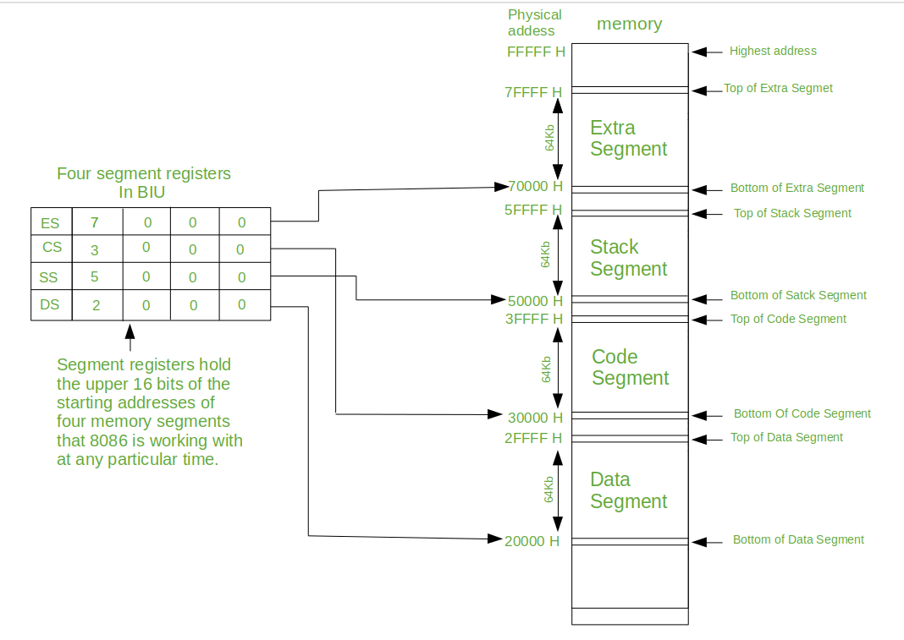

# Chapter 1: Introducing Computer Architecture

### Explain some technological problems that Charles Babbage experienced when designing his Analytical Engine

- The technology at the time was not sufficient to produce the complex components.
- Financing was difficult.

### What does ENIAC stand for and discuss the Von Neumann architecture briefly?

ENIAC `Electronic Numerical Integrator And Computer`, the first programmable general-purpose electronic computer.

#### Von Neuman architectuur

The `Von Neumann architecture` is a centralized design that consists of four key components:

- Processor
- Memory
- Input/output equipment
- A bus that connects these components


In the Von Neumann architecture, the `memory` is used to store both programs and data. 
The `processor` reads instructions from the memory and executes them. The `input/output equipment` is used to read data from external sources and to send data to external devices. 
The `bus` connects these components to each other and enables the processor to read data and instructions from the memory and send them to the input/output equipment.

### The microprocessor of the original IBM PC is the Intel 8088, which belongs to the Intel 80x86 microprocessor familybelongs. These i80x86 microprocessors operate with a segmented memory model:

#### What is a segment?

A `segment` is a portion of the available memory that is assigned a specific purpose of funtion.
On the `Intel 80x86` microprocessor family, segment where used to divide the memory into logical blocks, each of which could be accessed by a specific segment register.

#### What are the advantages of the segmented memory model?

- Allows **processor** to `access more memory` than it could directly address using it's instruction set.
- Improve`organisation of memory`, by allowing different segments to be used for different purposes.
- Inprove **processor** `performance`, by allowing it to access memory more quickly.

#### Despite the 16-bit architecture of the registers, the addressable memory space is 1 MB. Explain.

In the `segmented memory model`, the processeor uses a 16-bit segment register to keep track of the location of different segments in memory. 

Each segment has a specific starting address and a length, and the segment register contains a number that indicates the starting address of the segment.

The processor can than use the segment register adn an offset to calculate the actual memory address taht is needs to access.



##### Example

If the segment register contains the value `0x1000` and the offset is `0x0100`, the processor can access the memory address `0x1100` (0x1000 + 0x0100). In this way, the processor can access more memory than it could by directly acessing memory using its 16-bit instruction set.

### Describe Moore's Law. Discuss some limits that the linearization of this law does not support.

`Moore's Law` is a prediction that the number of transistors that could be placed on a computer chip would double approximately every two years.


#### Limitations

- There are `physical limits` to how small a transistor can get
- More prone to `overheating`
- The `cost` of designing and producing chips increased significantly as there complexity has increased

### Explain the abbreviations CPU and GPU and explain some essential differences between the operation of a CPU and a GPU.

CPU `Central Processing Unit`, is the primary processing unit of a computer. It is responsable for executing most of the instructions that the computer receives. 

GPU `Graphics Processing Unit`, is a specialized type of processor that is designed sepecifically for handeling graphics-related tasks.

#### Differences

- **Architecture**: `CPU's` are typaclly designed with a single core that can execute one instruction at a time, whereas `GPU's` have many smaller cores that can execute multiple instruction simultaneously.
- **Speed**: `CPU's` ar generaly faster in executing single instructions than a `GPU`, but `GPU's` are able to process many instructions simultaneously.
- **Power consumption**: Because `GPU's` have many smaller cores, they typacly consume more power than `CPU's`.

### Exersices on 6502 instruction set

#### Exercise 1
Write 6502 assembly code to store two 16-bit values at addresses $00-$01 and $02-$03.
Add these two 16-bit values and store the result at addresses $04-$05. Keep in mind the carry.

```asm
; 6502 Asambly

; Storing first number
LDA #$05 ; Load MSB in A register
STA $00  ; Store contents of A register at address 0x00

LDA #$FF ; Load LSB
STA $01

; Storing second number
LDA #$00
STA $02

LDA #$01
STA $03

CLC ; Clear the carry flag
ADC $01 ; Add value stored at address 0x01 to A register
STA $05 ; Store result at address 0x05

LDA $00
ADC $02
STA $04
CLC
```

#### Exercise 2
write 6502 assembly code to calculate the difference of two 16-bit values stored at
addresses $00-$01 and $02-$03. Store the result at addresses $04-$05. Take into account the borrow.

```asm
LDA #$00   ; Load the least significant byte of the first value
STA $00    ; Store it at address $00
LDA #$78   ; Load the most significant byte of the first value
STA $01    ; Store it at address $01
LDA #$00   ; Load the least significant byte of the second value
STA $02    ; Store it at address $02
LDA #$33   ; Load the most significant byte of the second value
STA $03    ; Store it at address $03

LDA $00   ; Load the least significant byte of the first value
SEC       ; Set the carry flag to 1
SBC $02   ; Subtract the least significant byte of the second value
STA $04   ; Store the result in the least significant byte of the result
LDA $01   ; Load the most significant byte of the first value
SBC $03   ; Subtract the most significant byte of the second value
STA $05   ; Store the result in the most significant byte of the result
```

#### Exercise 3
Write 6502 assembly code to store two 32-bit values at addresses $00-$03 and $04-$07.
Add the two 32-bit values via a loop/jump constructive, which iterates through all the bytes. Store the
result at addresses $08-$0B. Keep in mind the carry.

```asm
; 6502 Assambly

; Number 1
LDA #$01
STA $00

LDA #$01
STA $01

LDA #$01
STA $02

LDA #$01
STA $03

; Number 2
LDA #$01
STA $04

LDA #$01
STA $05

LDA #$01
STA $06

LDA #$01
STA $07

; Make a loop/jump to add these numbers and store at addresses 0x08-0x0B

CLC ; Clear carry flag
LDX #$03 ; Load 0x03 into X register

loop:
  LDA $00, X ; Load value at address 0x00 + value in X register
  ADC $04, X ; Add value at address 0x04 + value in X register to A register
  STA $08, X ; Store value in A register at address 0x08 + value stored in X register
  
  DEX ; Decrement X register
  CPX #$ff ; Check if X register == 0xff
  BNE loop ; Break if X == 0xff
```
